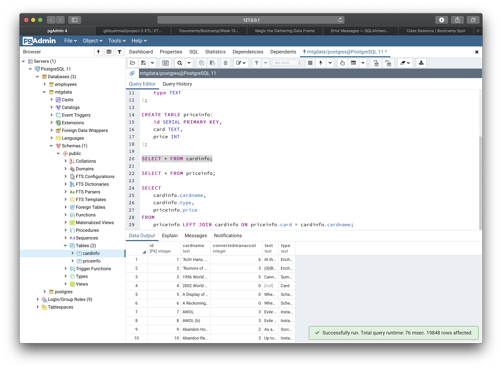
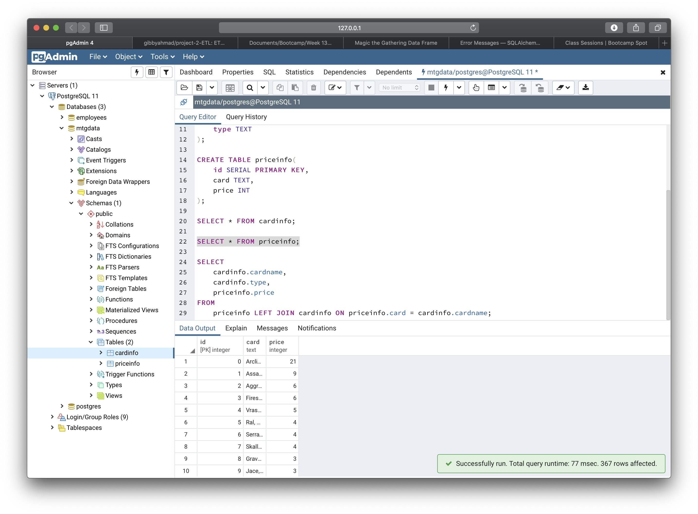
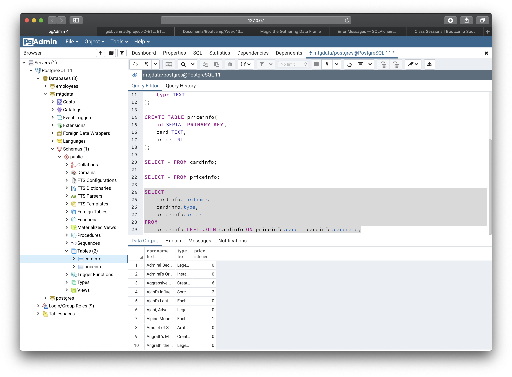

# Magic the Gathering Price List Database
Team MTG - Gibran Ahmed, Paul Dean, Soo Bin Hwang and Seunghwa Jun

## Overview
For MTG card players, a database that enables analyzing card price trends based on various metrics, such as converted mana cost and type is created. Combining these two databases would allow users to do trend analysis on these metrics, potentially allowing them to uncover opportunities for profit. There is a large "second-hand" market for sale and purchase of MTG card singles. Players would be able to get a better sense of which cards are under- and over-priced.

### Extract (Original data sources and formats)
* Magic the Gathering (MTG, collectable card games) from [Kaggle](https://www.kaggle.com/mylesoneill/magic-the-gathering-cards) in JSON
* [Card Price (War of the Spark)](https://www.mtggoldfish.com/index/XLN_GRN#paper) in HTML table

### Transform (Data cleaning and transformation process)
* Cleaning up the JSON file with the Pandas library
* Creating Pandas DataFrames with the cleaned data

### Load
* Creating a SQLite database and pushing data into it
* Setting up a connection to the database
* Pushing the Pandas DataFrames into the SQLite database
* Creating another engine for Postgres

Screenshots of the queries are shown below:

